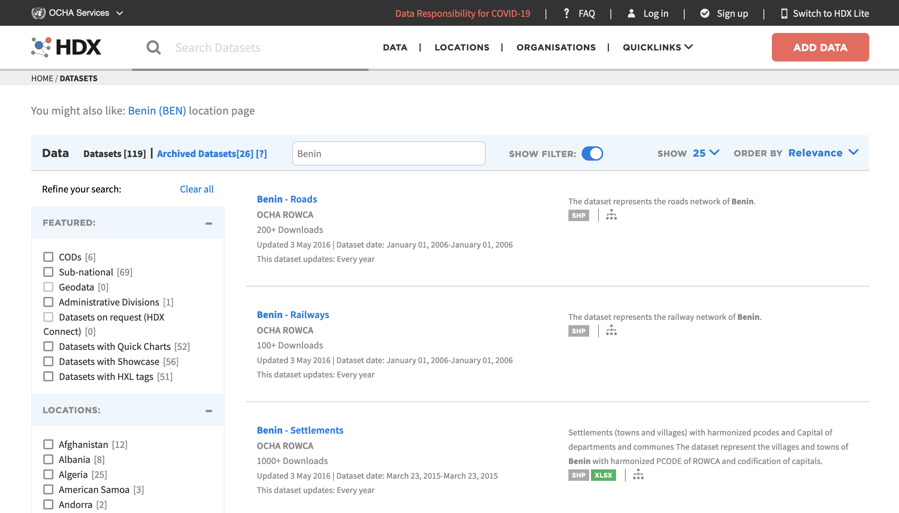

```{r setup, include=FALSE}

library(knitr)
library(rzine)
library(sf)
library(leaflet)
library(FactoMineR)
library(mapsf)

## Global options
options(max.print="75")
opts_chunk$set(echo=TRUE,
	             cache=FALSE,
               prompt=FALSE,
               tidy=FALSE,
               comment=NA,
               message=FALSE,
               warning=FALSE,
               class.source="bg-info",
               class.output="bg-warning")

# opts_knit$set(width=75)
```


# Humanitarian Data Exchange

Le signe **OCHA** désigne le **United Nation Office for the Coordination of Human Affairs** dont la vocation est de fournir une aide dans les situations d'urgence. Sa mission qui est expliquée en détail sur [son site web](https://www.unocha.org/about-ocha) comporte de nombreux volets. Cette agence est organisée sur un plan régional et comporte notamment une délégation spécialisée dans les pays d'Afrique Centrale et de l'Ouest appelée **OCHA-ROWCA** qui couvre l'ensemble despays ciblés par l'école d'été du CIST.

Pour mener à bien ses actions l'OCHA-ROWCA a développé un grand nombre de bases de données qui sont mises à jour régulièrement avec un accès à première vue facile. Ces données sont accessiblesà travers la plateforme [Humanitarian Data Exchange (HDX)](https://data.humdata.org/) qui semble avoir été mise au point par OCHA. Cette plateforme HDX ne comporte pas seulement des données mais aussi différents outils de visualisation ou d'analyse. 

Cela pourrait donc constituer une source majeure de données pour l'école d'été CIST 2022-2023, mais il faut en faire un inventaire précis. L'objet de cette note est de procéder à quelques explorations préliminaires en prenant comme cible le Bénin. 


Si nous effectuons une requête `Benin`  sur le site de données HDX ce qui conduit à une liste de 25 sources de données provenant soit de OCHA-ROWCA, soit d'autres agences des Nations-Unies (FAO, WorldBank, WolrdPop, ...). On trouve encore plus de sources (environ 200) si on utilise le menu de recherche par pays car le moteur ajoute dans ce cas des bases de données transnationales. 

Le HDX est donc un véritable hub de concentration des données les plus récentes sur les pays qui nousintéressent pour l'école d'été, et pas seulement le Benin.


```{r}

```

Comme on ne peut tout explorer d'un coup, nous commençons par les données qui viennet à proprement parler d'OCHA-ROWCA. 


Nous procédons ci-dessous à l'inventaire des sources mises à jour pour le Benin sur HDX.

## Limites administratives en 2019

Le dossier des limites administratives du Benin ([cliquer ici](https://data.humdata.org/dataset/benin-administrative-boundaries)) est accessible au format shapefile et comporte différentes couches correspondant aux différents niveaux administratifs. Sa datation laisse augurer qu'il s'agit de la situation la plus récente: les fichiers datent de juin 2021 mais leur nom comporte la séquence "20190816" qui doit plutôt correspondre au 16 Août 2019. 

```{r, fig.width=5,fig.cap="Départements et communes du Bénin (Source : OCHA-ROWCA)"}

adm0<-st_read("data/admin/ben_admbnda_adm0_1m_salb_20190816.shp",quiet = TRUE)
adm1<-st_read("data/admin/ben_admbnda_adm1_1m_salb_20190816.shp",quiet = TRUE)
adm2<-st_read("data/admin/ben_admbnda_adm2_1m_salb_20190816.shp", quiet = TRUE)

par(mar=c(0,0,0,0))
plot(adm2$geometry,col="lightyellow", border = "gray20",lwd=0.5)
plot(adm1$geometry,col=NA, border = "red",lwd=1, add=TRUE)
plot(adm0$geometry,col=NA, border = "black",lwd=2, add=TRUE)

```

## Villages et localités vers 2015

Un autre dossier accessible en [cliquant ici](https://data.humdata.org/dataset/benin-settlements) concerne le peuplement, c'est-à-dire l'inventaire de toutes les localisations avec leur nom et leur position en latitude longitude. Il comporte 6306 entrées. Les fichiers sont datés de 2015. 

```{r, fig.width=5,fig.cap="Village et peuplement au Benin vers 2015 (Source : OCHA-ROWCA)"}
loc<-st_read("data/settlement/ben_plp_NGA.shp")
par(mar=c(0,0,0,0))
plot(adm2$geometry,col="lightyellow", border = "gray20",lwd=0.5)
plot(loc$geometry,col="red",pch=16,cex=0.2, add=T)

```

A titre de vérification de la précision, nous effectuons une superposition sur le fonds de carte OpenStreetMap pour la commune de Ouidah (code BJ0304 ou BEN003004) ou aura lieu l'école d'été du CIST. En cliquant sur les points onpeut comparer leur nom avec celui des localités indiquées par OSM.

```{r, fig.width=5,fig.cap="Projection des données OCHA-ROWCA sur Open Street Map (commune de Ouidah"}
map<-adm2[adm2$admin2Pcod=="BJ0304",]
map<-st_transform(map,4326)

vil<-loc[loc$RowcaCode2=="BEN003004",]
vil<-st_transform(vil,4326)


map <- leaflet() %>% 
            addTiles() %>%
            setView(lat = 6.4, lng=2.1, zoom = 11) %>%
            addPolygons(data = map,
                        fill = FALSE,
                        color = "red",
                        weight = 2) %>%
             addMarkers(data = vil,
                        label = ~FULL_NAME_)

map
```

Il y a à l'évidence des décalages ... Et le contour de la commune lui-même ne semble pas coller exactement avec celui fourni par OSM. Il faudra vérifier laquelle des deux sources est erronée (à moins que ce ne soient les deux ?). Toutefois, la localisation semble rester approximativement juste ...

## Pyramide des âges 2019 (estim.)

Un dossier [accessible ici](https://data.humdata.org/dataset/benin-administrative-level-0-2-sadd-2019-projected-population-statistics) fournit les populations par âge et par sexe en 2019 au niveau des communes, départements ou pays entier. Il s'agit naturellement d'**estimations** mais les données n'en sont pas moins très utile pour toute analyse travaillant sur les situations présentes. Les classes d'âges sont suffisamment détaillées (tranches de 5 ans de 0 à 80 ans) pour procéder à des analyses démographiques intéressantes. A titre d'exemple, on réalise une AFC sur la pyramide des âges des 77 communes


```{r, fig.cap="AFC sur les structures par âge et sexe des communes du Benin en 2019 (Source : OCHA-ROWCA)"}
don<-read.table("data/pop2019/ben_adm2_pop.csv", sep=";",header=T, encoding = "UTF-8")
don2<-don[,c(11:44)]
row.names(don2)<-don$ADM2_PCODE

afc<-CA(don2,ncp = 10,graph = FALSE)
library(explor)
res <- explor::prepare_results(afc)
explor::CA_var_plot(res, xax = 1, yax = 2, lev_sup = FALSE, var_sup = FALSE,
    var_sup_choice = , var_hide = "Row", var_lab_min_contrib = 0, col_var = "Position",
    symbol_var = NULL, size_var = NULL, size_range = c(10, 300), labels_size = 10,
    point_size = 56, transitions = TRUE, labels_positions = "auto", xlim = c(-0.234,
        0.332), ylim = c(-0.187, 0.38))
```

On enchaîne par une CAH (sur les axes de l'AFC) :

```{r, fig.cap = "Type de structures par âge et sexe des communes du Benin en 2019 (source : OCHA)" }
cah <- HCPC(afc,nb.clust = 5,graph = FALSE)
plot.HCPC(cah,choice = "tree")

```


```{r, fig.cap = "Position des classes de la CAH sur les axes de l'AFC (source : OCHA)"}
plot.HCPC(cah,choice = "map", label.cex=0.3)
```


```{r}
adm2$clust<-cah$data.clust$clust

# set theme
mf_theme("dark")
# plot administrative status
mf_map(
  x = adm2, 
  var = "clust", 
  type = "typo",
  pal = c("red", "orange","yellow","green","blue"), 
  lwd = .5,
  leg_pos = "topright",
  leg_title = ""
)

# layout
mf_layout(title = "Typologie des structures par âge et sexe du Bénin (2019)",  
          scale = "FALSE",
          credits = paste0("Sources: OCHA, 2019\n",
                            "Ecole d'été CIST 2022"))


```


# Bibliographie {-}

<div id="refs"></div>


# Annexes {-}


## Infos session  {-}

```{r session_info, echo=FALSE}
kableExtra::kable_styling(kable(sessionRzine()[[1]], row.names = F))
kableExtra::kable_styling(kable(sessionRzine()[[2]], row.names = F))
```


## Citation {-}

```{r generateBibliography, echo=FALSE}

cat(readLines('cite.bib'), sep = '\n')

``` 

<br>

## Glossaire {- #endnotes}

```{js, echo=FALSE}

$(document).ready(function() {
  $('.footnotes ol').appendTo('#endnotes');
  $('.footnotes').remove();
});

```


