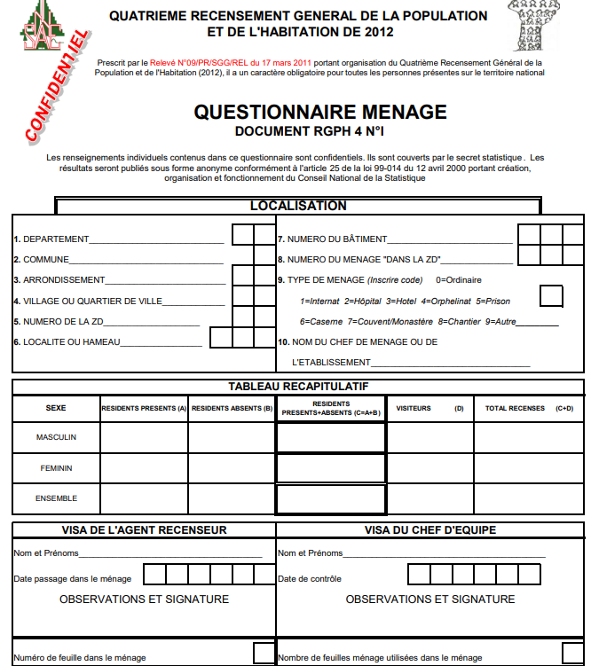
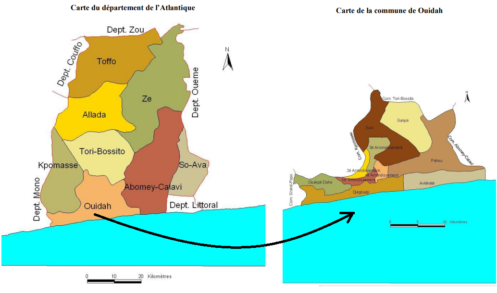

```{r setup, include=FALSE}

library(knitr)
library(rzine)
library(sf)
library(leaflet)
library(FactoMineR)
library(mapsf)
library(data.table)
library(tidyr)
library(dplyr)
library(ggplot2)
library(cowplot)
library(mapview)
library(DT)
library(stargazer)
library(wbstats)
library(rnaturalearth)
library(rnaturalearthdata)

library(quanteda)
library(tidytext)
library(plotly)
library(RColorBrewer)


## Global options
options(max.print="75")
opts_chunk$set(echo=TRUE,
	             cache=FALSE,
               prompt=FALSE,
               tidy=FALSE,
               comment=NA,
               message=FALSE,
               warning=FALSE,
               class.source="bg-info",
               class.output="bg-warning")

# opts_knit$set(width=75)
```


# LE RECENSEMENT DE 2013

Les données individuelles sont celles qui offrent les plus riches possibilités de traitement puisqu'il est possible de les agréger selon des dimensions sociales ou spatiale multiples et ainsi produire des tableaux en nombre virtuellement infini. Elles posent cependant des questions de nature différentes selon qu'elles portent sur un échantillon limité ou une population exhaustive.

**Mouftaou Amadou Sanni** souligne l'imporance de l'IREDA qui a réalisé un inventaire des Recensements de Population (RGPHs) et Enquetes Demographiques d'acces libre que l'on peut trouver en suivant   [ce lien]([www.ireda.ceped.org). A partir de ce lien, on peut accéder librement en ligne aux Recensements et Enquetes Démographiques de 23 pays d'Afrique Subsaharienne y compris le Benin.

> "IREDA: Inventaires des Recensements et Enquetes en Afrique" est un projet Exécuté par CEPED/Paris en collaborations avec des intitutions afticaines de collecte de données et de Recherche dont mon Institution le CEFORP/Cotonou. Ce projet a démarré en 2008; il s'est inscrit dans la dynamique de sauvegarde, de conservation et de valorisstion des opérations de collecte sous la forme d'inventaires documentés. Il a été co-financé par Paris21-INSEE-IRD-OIF-CESD "Statistiwues pour Développement 

A partir du site de l'IREDA, on peut notamment accéder à un catalogue d'archives des enquêtes et recensement du Benin en suivant [ce lien](https://nada.insae.bj/index.php/catalog) qui comporte pas moins de 30 fiches descriptives d'enquêtes ou de recensements.

## Données disponibles

Parmi les ressources disponibles, une source incontournable est naturellement le dernier recensement du Benin pour lequel on peut retrouver un grand nombre de fichiers et de publications relatives à la collecte et aux résultats en suivant [ce lien](https://nada.insae.bj/index.php/catalog/18) qui donne accès au téléchargement direct de l'ensemble des archives disponibles. 


```{r, fig.width=8, echo=FALSE}

```


### Métadonnées

Avant toute exploitation statistique des données, il peut être intéressant de montrer aux étudiants tout le détail du processus de réalisation du recensement en s'appuyant à la fois sur la [documentation générale](https://nada.insae.bj/index.php/ddibrowser/18/export/?format=pdf&generate=yes) et sur le [bulletin d'enquête](https://nada.insae.bj/index.php/catalog/18/download/301) proprement dit 

```{r, fig.width=8, echo = FALSE}

```

Mais bien d'autres documents méritent également d'être analysés, notamment ceux relatifs aux procédures de recueil, saisie ou contrôle et ceux relatifs au coût financier de l'opération de recensement. 

### Rapports officiels

La relative ancienneté de ce recensement présente en fait l'avantage de montrer l'ensemble des exploitations officielles qui ont pu en être faites sous l'égide de l'INSAE, à destination des décideurs politiques de tous niveaux mais aussi des entreprises ou des citoyens. Le point commun de la majorité des rapports est de fournir un très grand nombre de tableaux croisés (tris à plat) qui présentent les dénombrement des populations et des ménages à touts les échelles. On notera à cet égard le grand intérêt de la collection des *cahiers de village* qui fournissent pour chacun des douze départements du Bénin des tableaux très précis des situations locales. Malheureusement, seule une partie d'entre eux fournit une cartographie des contours des arrondissements (niveau de découpage infracommunal) et il est en général impossible de localiser les villages qui sont le niveau géographique d'observation le plus fin. Notons enfin que les seules cartes fournies dans ces rapports le sont à l'échelle des départements mais pour ainsi dire jamais à l'échelles des communes et encoremoins à celle des arrondissements.

```{r, fig.width=8, echo =FALSE}

```


> **La cartographie locale** semble donc être un enjeu très important pour l'école d'été CIST 2022, mais il ne semble pas forcément évident d'obtenir les contours des unités spatiales de collecte les plus petites (arrondissements, villages) ni même leur géolocalisation. Ces données ne sont en tous les cas pas disponibles sur le site du recensement que nous avons examinée. Elle relèvent probablement d'u autre organisme national (Insitut Géographique National ?) à moins qu'elles ne soient soumises à des règles de confidentialité. 


### Données individuelles

Nous avons découvert à notre grande surprise que les bulletins individuels de recensement des populations et des ménages sont librement accessibles dans le dossier d'archive mis à la disposition du public sous l'appellation "masque de saisie" en suivant [ce lien](https://nada.insae.bj/index.php/catalog/18/download/444). Plus précisément, on obtient un dossier contenant deux fichiers :

- *le fichier de données INSAE_RGPH4_2013.dat* (978 Mo) contient l'enssemble exhaustif des informations sur les points d'enquête (localisation en département, commune, arrondissement, village, bloc, numéro de ménage),  les individus, les ménages et les décès survenus au cours des dernières années.
- *le dictionnaire de métadonnées INSAE_RGPH4_2013.dcf* (103 Ko) décrit de façon précise et détaillée les champs d'information et les codes de chacune des variables.

On peut  lire le fichier en se servant d'un programme R, mais celui-ci est très lourd (près de 20 millions de lignes) et pour les utilisateurs débuutants de R il est  plus simple de l'ouvrir avec le logiciel CSPro qui est l'application qui a été utilisée pour réaliser le recensement au Benin comme dans de nombreux pays africains. 

## Exploitation avec CSPro

> CSPro, abréviation de **Census and Survey Processing System** est un ensemble logiciel comprenant compilateur et différents outils spécialisés dans le développement d’applications de collecte, visualisation, traitement et analyse de données. C’est un logiciel développé par le Census Bureau des États-Unis ainsi que ICF international. Serpro S.A était aussi impliqué dans les premières étapes du développement de CSPro. Le financement de ce programme provient principalement de l’USAID. La première version de CSPro remonte à mai 2000, cependant le développement de ses ancêtres : ISSA et IMPS remonte a plus de 30 années. Les dernières versions du compilateur et des outils sont conçues pour être utilisées sur les ordinateurs ayant comme système d'exploitation Windows 7 et plus. Cependant, les applications implémentées avec CSPro 7+ peuvent être déployées sur n’importe quel ordinateur, tablette, smartphone utilisant Android, Windows UWP ou Windows 7, 8 , 10.  CSPro dispose d’un environnement de développement très simple, mais la puissance de son langage de programmation propre : Le Cspro Programming Language (CPL) lui permet de concevoir des applications complexes et intelligentes susceptibles d’être utilisées dans des domaines variés (Formulaires électroniques pour  Enquêtes et Recensements, implémentation de système d'information sophistiqués : Suivi-Evaluation, Administration et Gestion d’entreprises etc.) Source : [Wikipedia.France](https://fr.wikipedia.org/wiki/CSPro)

Ce logiciel étant gratuit, nous avons pu effectuer un test d'utilisation sur les fichiers du Benin qui s'ouvrent effectivement sans difficultés et peuvent être ainsi décodés rapidement : 


```{r, fig.width=8, echo =FALSE}

```

- **Remarques**: Si la disponibilité de ces données semble avérée (lien web public) il faut toutefois faire preuve de prudence dans leur dissémination car il semble possible d'accéder à des données individuelles sensibles ce qui poserait des questions éthiques. Notons pour l'anecdote que l'une des professions possible est "*Président de la République*" (code 001), catégorie qui n'apparaît que pour trois individus sur les dix millionsque compte le Benin... Si on souhaite utiliser ces données dans un cadre pédagogique, il sera sans doute préférable de les anonymiser ce qui constitue en soi un excellent exercice pédagogique. 

### Exemple d'utilisation 


Nous utilisons ici un tableau qui a été réalisé à l'aide de CSPro en croisant les variables "*Département de résidence actuel*" et "*Département de résidence antérieur*". Nous excluons de ce fait les mobilités internationales entrantes et nous ne prenons pas en compte l'ancienneté de la migration qui est variable puisque le recensement demande uniquement le **dernier** changement de domicile. 

```{r, echo=FALSE, }
mig<-read.table("data/rp2013/mobil2013.csv", sep=";",header=T)
tab<-reshape2::dcast(mig,formula = name_i~name_j,value.var = "Fij")
mat<-as.matrix(tab[,-1])
rownames(mat)<-tab[,1]
colnames(mat)<-substr(colnames(mat),1,3)
mat2<-addmargins(mat)
kable(mat2,caption = "Migrations interdépartementales au Bénin  (source : RGPH 2013)")
```

> **Commentaire** : Les lignes correspondent au département de résidence précédente et les colonnes au département de résidence actuelle. La diagonale correspond aux individus présents dans un département n'ayant pas déclaré avoir résidé dans un autre. Les personnes recensées qui déclare avoir résidé à l'étranger sont exclues ce qui explique que le total général soit 9.62 millions d'habitants et non pas de 10 millions. On peut déduire de la somme des lignes et des colonnes (hors diagonale) la somme des départs et des arrivées, ce qui permet par la suite de calculer le volume des migrations et le solde migratoire. On peut enfin examiner pour chaque paire de département la quantité d'échanges bilatéraux ainsi que les transferts nets. Par exemple, on trouve 1319 migrants du département d'Atacora vers celui d'Alibori contre 3246 dans la direction opposée. 

Ce tableau peut donc servir de base à une initiation à l'étude des migrations interne du pays, un premier exercice pouvant consister à en extraire les indicateurs de base sur les départements.


```{r, echo=FALSE}
département<-rownames(mat)
population<-apply(mat,1,FUN="sum")
stables<-diag(mat)
mat0<-mat
diag(mat0)<-0
départs<-apply(mat0,1,FUN="sum")
arrivées<-apply(mat0,2,FUN="sum")
volume<-arrivées+départs
solde<-arrivées-départs
asymétrie<-solde/volume
tab<-data.frame(département,population,stables,départs, arrivées,volume,solde)
tab$tx_mob<-100*volume/population
tab$tx_emi<-100*départs/population
tab$tx_imm<-100*arrivées/population
tab$tx_asy<-100*solde/volume
kable(tab,digits = c(0,0,0,0,0,0,0,2,2,2,2),row.names = F, caption = "Synthèses des migrations inter-départementales du Bénin (source : RGPH, 2013)")
```

> **Commentaire** : Si les chiffres du recensement sont exacts et si nous n'avons pas commis d'erreurs ... le tableau met en évidence des évolutions démographiques très contrastées d'un département à l'autre en termes de mobilité et d'attractivité migratoire. Ainsi le département d'**Alibori** se caractérise apparemment par une très faible mobilité avec un taux d'émigration de 3.3\% et un taux d'immigration de 1.5\% soit un solde migratoire négatif de -15219 habitants. Le département de l'**Atlantique** est quant à lui le plus attractif avec un solde migratoire de +248063 habitant qui s'explique par un taux d'immigration exceptionnel (près du tiers de ses habitants actuels ont résidé antérieurement dans un autre département). A l'inverse, le département du **Littoral** est caractérisé par un solde migratoire de -246908 habitant qui s'explique par une très forte mobilité combinant une assez forte immigration (16\%) et une très forte immigration (45\%). On peut supposer que cela correspond à un phénomène de plaque tournante de la métropole de Cotonou qui attire et renvoie de nombreux migrants de tout le pays tout en s'étalant progressivement au delà des limites étroites de son département vers des périphéries urbaines situées dans les départements de l'Atlantique et de Oueme. Notons pour finir que le département de **Bhttp://127.0.0.1:32566/rmd_output/0/#annexesorgou** connaît également une évolution très positive liée à la croissance de la ville de Parakou, métropole du Nord.  

## Exploitation directe avec R 

L'inconvénient de CSPro est de limiter les possibilités de croisement des données puisque l'outil de base est le tableau à 2 dimensions. Or, il est possible d'obtenir des tableaux beaucoup plus intéressants en utilisant des programmes R qui lisent directement les fichiers de données brutes. A titre d'exemple, nous allons montrer (sans détaillerles programmes) un exemple d'analyse des **trajectoires de mobilités** où nous relevons pour chaque individu trois points dans l'espace-temps.

### Construction du tableau de données

1. Lieu (*loc1*) et (*dat1*) date de naissance de l'individu
2. Lieu (*loc2*) et date de départ (*dat2*) de la dernière résidence si elle est différente de la résidence actuelle
3. Lieu (*loc3*) et date de recensement (*dat3*) dans la résidence actuelle.

On peut en déduire trois autres variables booléennes indiquant l'existence de mobilités passées

- *mob13* : migration durée de vie, si le lieu de naissance est différent du lieu de recensement
- *mob23* : dernière migration, si l'individu a déclaré avoir résidé antérieurement dans un autre lieu
- *mob12* : migration entre la naissance et le dernier lieu de résidence avant le lieu de recensement.

On peut ensuite ajouter au fichier autant de données que l'on souhaite relatives à l'individu ou au ménage. Ici, on a jouté à titre d'exemple uniquement deux variables  :

- *ref* : indique si l'individu concerné est la personne de référence du ménage ou non.
- *sex* : indique si l'individu concerné est un homme ou une femme. 

On choisit ici de retenir les individus qui ont déclaré avoir effectué à la fois une mobilité 1-2 et une mobilité 2-3, ce qui donne un tableau comportant 635051 observations. Il est probablement incomplet car beaucoup d'individus n'ont pas renseigné la seconde localisation ou bien l'ont fait de façon imprécise. Mais il offre néanmoins de nombreuses possibilités d'utilisation pédagogique : 


```{r}
dt<-readRDS("data/rp2013/mobind.RDS")
dt<-data.table(dt)
dt2<-dt[mob12+mob23==2 &is.na(dat2)==F]
kable(head(dt2))

```

> La première ligne du tableau ci-dessus correspond à un homme chef de ménage qui avait environ 34 ans lors du recensement de 2013. Il est né dans la commune de Dassa en 1979, puis a effectué au moins une migration qui l'a amené à un date inconnue à Abomey-Calavi d'où il est parti en 2005 pour Banikoara où il résidait en 2013.
> La seconde ligne du tableau correspond à une femme qui n'est pas chef de ménage et avait environ 30 ans lors du recensement de 2013. Elle est née en 1983 dans la commune de Banikoara puis est partie à une date inconnue à Cotonou qu'elle a quitté en 2008 pour revenir dans sa commune d'origine. 


Comme on peut le voir avec les deux exemples précédents, le tableau permet de repérer soit des **trajectoires complexes** mettant en jeu trois lieux différents, soit des **trajectoires d'aller et retour** concernant des individus qui sont revenus dans leur commune de naissance après avoir séjourné dans une autre commune. 


```{r}
dt3<-dt[ref=="O"][as.numeric(loc1)<150][substr(loc1,3,3)!=0][substr(loc2,3,3)!=0][dat1<3000][dat1<1998]
dt3$age<-2013-dt3$dat1
hist(dt3$age)
summary(dt3$age)
```


### Exemple des mobilités depuis ou vers Cotonou

Etudions à tire d'exemple le cas de l'ensemble des personnes qui ont déclarées être présentes dans la commune de Cotonou (code 081) a un moment ou un autre de leur parcours migratoire. On peut distinguer 8 cas


1. Résidence permanente à Cotonou (loc1 = loc2 = loc3 = Cotonou)
2. Arrivée à Cotonou sans relais  (loc1 = X, loc2 = X, loc3 = Cotonou)
3. Arrivée à Cotonou avec relais  (loc1 = X, loc2 = Y, loc3 = Cotonou)
4. Départ puis retour à Cotonou   (loc1 = Cotonou, loc2 = X, loc3 = Cotonou)
5. Départ de Cotonou sans relais  (loc1 = loc2 = Cotonou, loc3 = X)
6. Départ de Cotonou avec relais  (loc1 = Cotonou, loc2 = X, loc3 = Y)
7. Aller à Cotonou puis retour    (loc1 = X, loc2 = Cotonou, loc3 = X)
8. Aller à Cotonou puis départ    (loc1 = X, loc2 = Cotonou, loc3 = Y)


  
  


```{r}
com<-"081"
cas1<-dt[loc1==com][loc2==com][loc3==com][,cas:=1]
cas2<-dt[loc1!=com][loc2==loc1][loc3==com][,cas:=2]
cas3<-dt[loc1!=com][loc2!=loc1][loc2!=com][loc3==com][,cas:=3]
cas4<-dt[loc1==com][loc2!=com][loc3==com][,cas:=4]
cas5<-dt[loc1==com][loc2==loc1][loc3!=com][,cas:=5]
cas6<-dt[loc1==com][loc2!=loc1][loc3!=com][loc3!=loc2][,cas:=6]
cas7<-dt[loc1!=com][loc2==com][loc3==loc1][,cas:=7]
cas8<-dt[loc1!=com][loc2==com][loc3!=loc1][loc3!=com][,cas:=8]
tabcom<-rbind(cas1,cas2,cas3,cas4,cas5,cas6,cas7,cas8)
tabcom$cas<-as.factor(tabcom$cas)
levels(tabcom$cas) <-c("1. Résidence permanente" ,
                       "2. Arrivée sans relais " ,
                       "3. Arrivée avec relais"  ,
                       "4. Aller et retour"      ,
                       "5. Départ sans relais"   ,
                       "6. Départ avec relais"   ,
                       "7. Passage puis retour"  ,
                       "8. Passage puis départ")

res<-tabcom[,.(nb=.N),.(cas)]
restot<-data.table(cas="Total",nb=dim(tabcom)[1])
res2013<-data.table(cas="Résidents 2013 (1+2+3+4)",nb=sum(res[1:4]$nb))

res[c(1,4,5,6),sum(nb)]
natifs<-data.table(cas="Natifs (1+4+5+6)",nb=sum(res[c(1,4,5,6)]$nb))
res<-rbind(res,res2013,natifs,restot)
res$pct<-100*res$nb/restot$nb
kable(res,digits = c(NA,0,2),caption = "Cotonou dans le système migratoire du Bénin (RP 2013)")

```

> Cet exemple montre que près d'un million de personnes recensées au Bénin en 2013 (soit environ 10% de la population) sont "passées" à un moment ou un autre de leur parcours migratoire par Cotonou. On remarque aussi que le nombre de natifs de Cotonou présents au Bénin en 2013 (613450) est supérieur à la population de la commune à cette date (581352). il s'agit donc d'une plaque tournante migratoire majeure pour le pays, mais dont l'espace est saturé et qui redistribue plus de population vers le reste du pays qu'elle n'en reçoit.

### Exemple des mobilités depuis ou vers Parakou

Le programme précédent peut être transformé en fonction applicable à n'importe quelle commune du Benin et ultérieurement implanté sous forme de site web pour apprécier les différences de fonctionnement des territoires. A titre d'exemple, considérons justes le cas de Parakou (code 045), métropole en pleine croissance qui polarise le nord du pays.


```{r}
com<-"045"
cas1<-dt[loc1==com][loc2==com][loc3==com][,cas:=1]
cas2<-dt[loc1!=com][loc2==loc1][loc3==com][,cas:=2]
cas3<-dt[loc1!=com][loc2!=loc1][loc2!=com][loc3==com][,cas:=3]
cas4<-dt[loc1==com][loc2!=com][loc3==com][,cas:=4]
cas5<-dt[loc1==com][loc2==loc1][loc3!=com][,cas:=5]
cas6<-dt[loc1==com][loc2!=loc1][loc3!=com][loc3!=loc2][,cas:=6]
cas7<-dt[loc1!=com][loc2==com][loc3==loc1][,cas:=7]
cas8<-dt[loc1!=com][loc2==com][loc3!=loc1][loc3!=com][,cas:=8]
tabcom<-rbind(cas1,cas2,cas3,cas4,cas5,cas6,cas7,cas8)
tabcom$cas<-as.factor(tabcom$cas)
levels(tabcom$cas) <-c("1. Résidence permanente" ,
                       "2. Arrivée sans relais " ,
                       "3. Arrivée avec relais"  ,
                       "4. Aller et retour"      ,
                       "5. Départ sans relais"   ,
                       "6. Départ avec relais"   ,
                       "7. Passage puis retour"  ,
                       "8. Passage puis départ")

res<-tabcom[,.(nb=.N),.(cas)]
restot<-data.table(cas="Total",nb=dim(tabcom)[1])
res2013<-data.table(cas="Résidents 2013 (1+2+3+4)",nb=sum(res[1:4]$nb))

res[c(1,4,5,6),sum(nb)]
natifs<-data.table(cas="Natifs (1+4+5+6)",nb=sum(res[c(1,4,5,6)]$nb))
res<-rbind(res,res2013,natifs,restot)
res$pct<-100*res$nb/restot$nb
kable(res,digits = c(NA,0,2),caption = "Cotonou dans le système migratoire du Bénin (RP 2013)")

```
> Cet exemple montre qu'environ 300 000 de personnes recensées au Bénin en 2013 sont "passées" à un moment ou un autre de leur parcours migratoire par Parakou. On remarque aussi que le nombre de natifs de Parakou présents au Bénin en 2013 (194345) est supérieur à la population de la commune à cette date (239026). A l'inverse de Cotonou, cette commune de Parakou retient donc plus de migrants qu'elle n'en redistribue vers le reste du pays. Il s'agit d'un pôle d'accumulation. 


### Exemple de modèle de choix conditionnel : Parakou ou Cotonou ?

Pour répondre à la demande de France et Mouftaou de construire des applications des modèles logistique ou multi-niveau, on peut construire un exemple simple de modèle de choix en considérant les personnes chef de ménage et âgées de plus de 18 ans en 2013 qui ont quitté leur commune de naissance pour se rendre respectivement à Cotonou (0) ou à Parakou (1). On trouve 128473 individus répondant à ces critères parmi lesquels on tire au hasard un échantillon de 1000 personnes :


```{r}
sel<-dt[!loc1 %in% c("045","081")][loc3 %in% c("045","081")][dat1<1995][ref=="O",.(sex,age = 2013-dat1,ori=loc1_name,dest=as.character(loc3_name))]
kable(head(sel))
```
#### Effet isolé du sexe

```{r}
tabcont<-table(sel$sex,sel$dest)
test<-chisq.test(tabcont)
chi<-round(test$statistic,2)
pval<-cut(test$p.value,breaks=c(0,0.001,0.01,0.1,1))
levels(pval)<-c("***","**","*","n.s.")
res<-paste("Chi-2 = ", chi, ", df = ",test$parameter,"sign = ", pval)
plot(tabcont,col=c("lightyellow","orange"), main = "Les femmes préfèrent Cotonou ?", sub=res)

```


#### Effet isolé de l'âge


```{r}
sel$age2<-cut(sel$age,breaks=c(18,25,35,45,55,65,100))
tabcont<-table(sel$age2,sel$dest)
test<-chisq.test(tabcont)
chi<-round(test$statistic,2)
pval<-cut(test$p.value,breaks=c(0,0.001,0.01,0.1,1))
levels(pval)<-c("***","**","*","n.s.")
res<-paste("Chi-2 = ", chi, ", df = ",test$parameter,"sign = ", pval)
plot(tabcont,col=c("lightyellow","orange"), main = "Les jeunes préfèrent Parakou ?", sub=res)

```


# Bibliographie {-}

<div id="refs"></div>


# Annexes {-}


## Infos session  {-}

```{r session_info, echo=FALSE}
kableExtra::kable_styling(kable(sessionRzine()[[1]], row.names = F))
kableExtra::kable_styling(kable(sessionRzine()[[2]], row.names = F))
```


## Citation {-}

```{r generateBibliography, echo=FALSE}

cat(readLines('cite.bib'), sep = '\n')

``` 

<br>

## Glossaire {- #endnotes}

```{js, echo=FALSE}

$(document).ready(function() {
  $('.footnotes ol').appendTo('#endnotes');
  $('.footnotes').remove();
});

```


